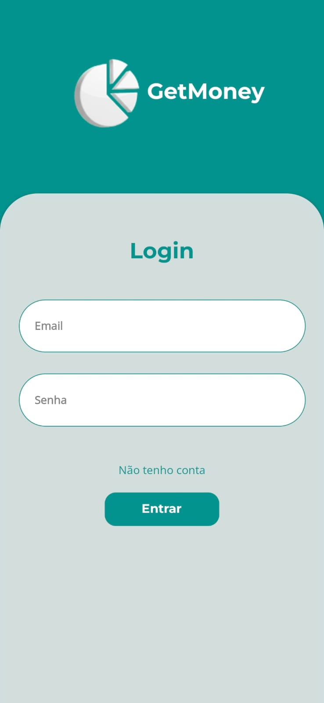
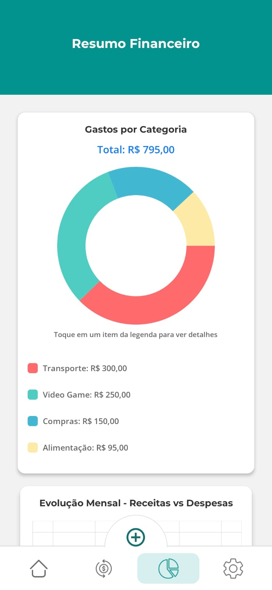
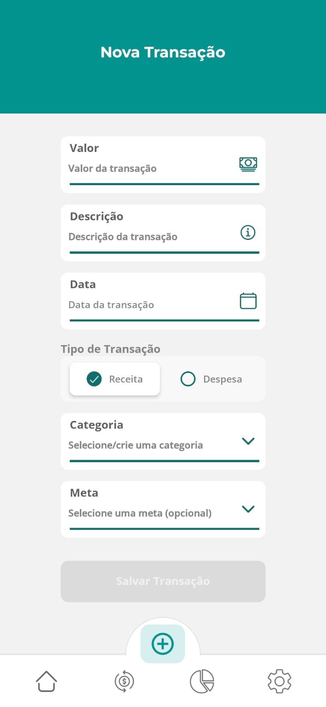

# GetMoney - Aplicativo de Controle Financeiro Pessoal

<div align="center">

[](https://java.com)
[](https://spring.io)
[](https://reactnative.dev)

*Controle suas finanças de forma inteligente e simplificada*

</div>

## 📋 Visão Geral

O GetMoney é um aplicativo mobile multiplataforma para controle financeiro pessoal, permitindo registrar manualmente receitas e despesas, categorizar transações e visualizar relatórios financeiros através de gráficos interativos.

> ⚠️ **Importante**: Este aplicativo não realiza transações financeiras reais nem possui relação com instituições bancárias. É uma ferramenta de gestão pessoal para registro de dados criados pelo usuário.

## 🚀 Funcionalidades Principais

### 💰 Gestão Completa de Finanças
- **Controle de Gastos**: Registre e categorize seus gastos
- **Gestão de Receitas**: Acompanhe todas as fontes de renda
- **Histórico Financeiro**: Visualize todo seu histórico com relatórios detalhados
- **Metas de Economia**: Defina e acompanhe metas financeiras

### 📊 Dashboard Interativo
- Gráficos de pizza para visualização de gastos por categoria
- Gráficos de linha para evolução mensal de receitas vs despesas
- Métricas financeiras essenciais em tempo real
- Interface intuitiva para análises rápidas

## Interface do GetMoney
<table> <tr> <td align="center">  <br/> <strong>Tela de Abertura</strong> <br/> <em>Tela inicial do aplicativo</em> </td> <td align="center">  <br/> <strong>Autenticação</strong> <br/> <em>Acesso seguro à sua conta</em> </td> </tr> <tr> <td align="center">  <br/> <strong>Visão Geral Financeira</strong> <br/> <em>Dashboard com gráficos e métricas</em> </td> <td align="center">  <br/> <strong>Gestão de Transações</strong> <br/> <em>Registro de novas receitas e despesas</em> </td> </tr> </table></div>

## 🏗️ Arquitetura do Projeto

### Backend (API REST)
```plaintext
📦 GetMoney Backend
├── 🗃️ Java 21
├── 🍃 Spring Boot 3.5.4
├── 🔐 Spring Security + JWT
├── 📚 Spring Data JPA
├── 🗄️ Banco de Dados H2/PostgreSQL
└── 📖 Swagger/OpenAPI 3.0

📦 GetMoney Mobile
├── ⚛️ React Native
├── 🔷 TypeScript
├── 🧭 React Navigation
├── 📡 Axios para consumo de API
├── 💾 AsyncStorage para persistência local
├── 🎨 Styled Components para estilização
└── 📊 Victory Native para gráficos


👨‍💻 Desenvolvedor
GitHub: @Gustasilvadev